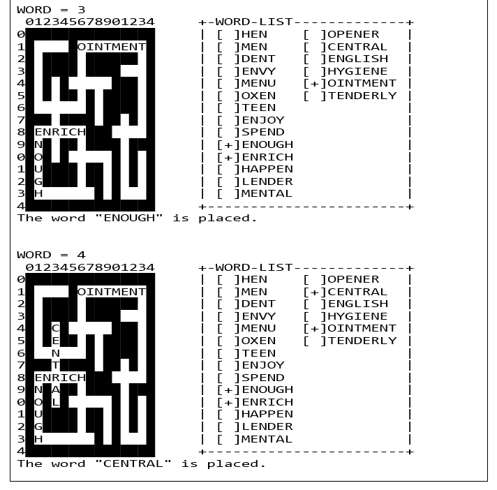

# Word Puzzle

- The aim of the project is to fit each word into its spot. When all words are placed in the field, the puzzle will be completed.
- The program reads "puzzle.txt" and "dictionary.txt". It fills puzzle with proper words from "dictionary.txt". 
- Finally, it generates "solution.txt" file which contains the completely filled puzzle.
- Sample Screen :

